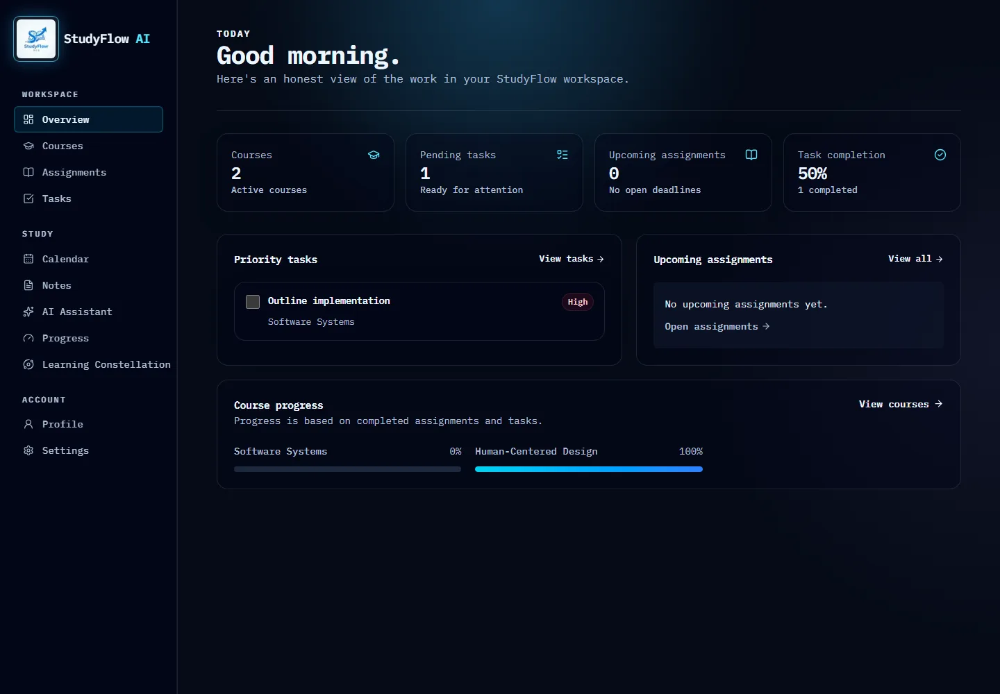
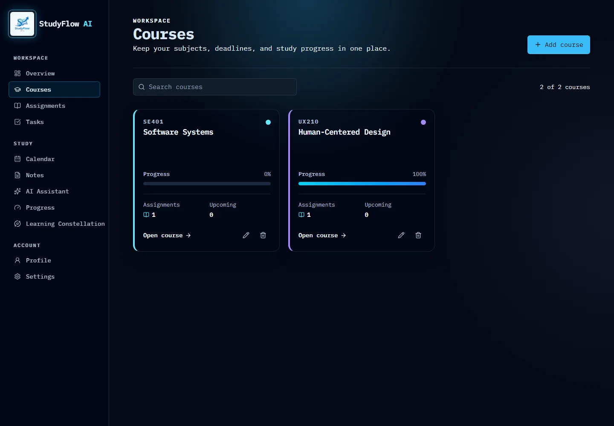
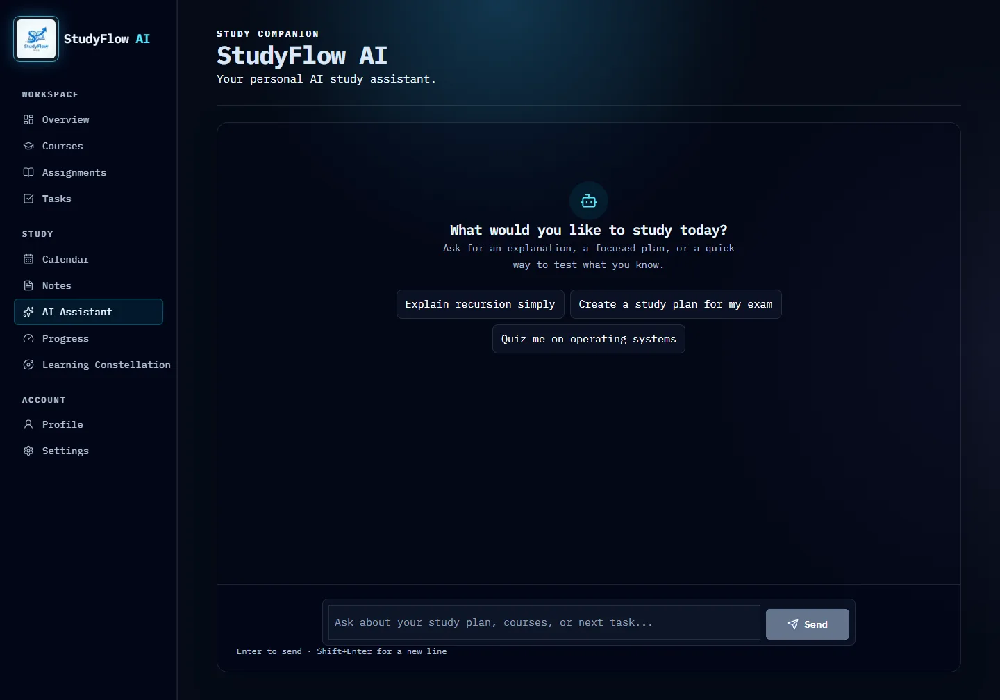
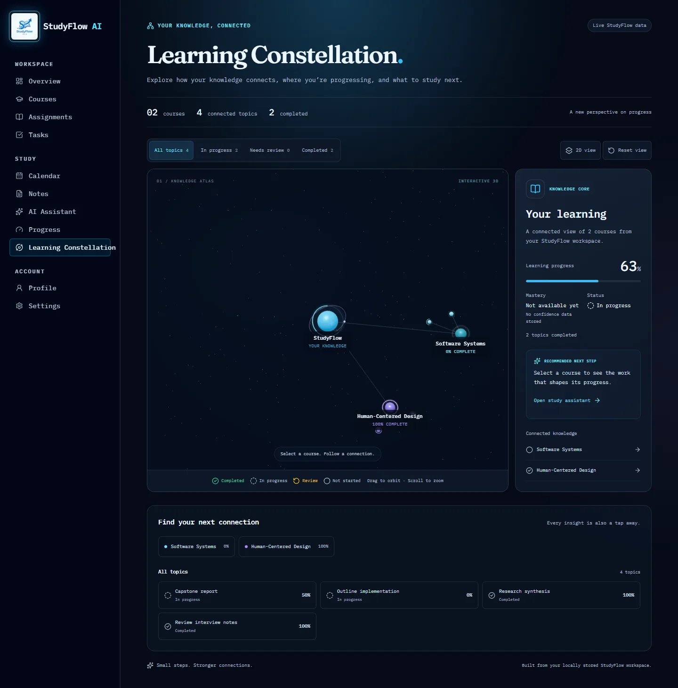

# StudyFlow AI

StudyFlow AI is a learning productivity application designed for students who need one place to manage courses, assignments, tasks, notes, and study priorities. It combines structured academic planning with a context-aware AI study assistant and an interactive Learning Constellation that visualizes real course progress and work in progress. I chose this idea because student productivity tools often separate planning, progress tracking, and study support, while StudyFlow brings those workflows together in a single focused application.

## Project Brief

StudyFlow AI solves the problem of fragmented student planning and study support by bringing academic management, progress tracking, and AI guidance into one workflow. It is designed for students who need to coordinate courses, assignments, tasks, and study priorities without switching between separate tools. I chose this idea because many productivity tools handle planning or progress in isolation, but students often need all of those decisions in the same place while they are actively studying.

## Live Application

- Production URL: https://studyflow-ai-ivory-xi.vercel.app
- Repository: https://github.com/YahyaSami1147/studyflow-ai

## Core Features

- course management
- assignment tracking and task management
- progress tracking across saved course work
- local StudyFlow persistence using the shared browser storage record
- streamed AI assistant
- contextual StudyFlow data supplied to the model for relevant learning help
- Stop, retry, and error-state handling in the chat flow
- interactive Learning Constellation
- responsive/mobile UI
- accessible 2D representation and WebGL fallback
- reduced-motion support

## AI Integration

AI is part of the StudyFlow workflow rather than being presented as a generic chatbot. The repository uses the Vercel AI SDK with NVIDIA’s OpenAI-compatible endpoint and the model `nvidia/nemotron-3.5-lightning-30b-a3b` defined in `src/lib/ai/config.ts`. Requests are handled server-side in `src/app/api/chat/route.ts`, which uses `streamText`, `convertToModelMessages`, `toUIMessageStream`, and `createUIMessageStreamResponse` for streaming responses. The route includes `maxDuration = 30`, server-side provider configuration, and request validation before the model call.

The AI assistant receives the user’s current StudyFlow context through the study-flow context formatter and parser, and the system prompt tells the model to use saved courses, assignments, tasks, and progress when relevant rather than inventing data. The app passes real StudyFlow state into the model so the assistant can help with study planning, workload review, task prioritization, and concept support using the same local data that drives the rest of the interface. The production safeguard is server-only: `NVIDIA_API_KEY` is kept in `process.env` and never exposed to the browser, and the route rejects malformed, empty, oversized, or overly long requests before model conversion.

The request validation layer in `src/app/api/chat/request-validation.ts` enforces finite request size and message limits, including:

- maximum of 32 messages
- maximum of 8,000 characters per user message
- maximum serialized request size of 120,000 characters
- maximum StudyFlow context size of 24,000 characters

The chat UI also implements stop generation, retry, error-state, and partial-response handling so the experience stays usable even when a stream is interrupted or a provider call fails.

## Architecture Overview

```text
StudyFlow AI
│
├── Application UI
│   ├── Dashboard
│   ├── Courses
│   ├── Assignments / Tasks
│   └── Study progress
│
├── Local Study Data
│   └── localStorage: studyflow:data
│
├── AI Assistant
│   └── /api/chat
│       ├── request validation
│       ├── StudyFlow context
│       ├── streaming responses
│       └── NVIDIA provider integration
│
└── Learning Constellation
    ├── real StudyFlow data adapter
    ├── React Three Fiber / Three.js
    └── accessible fallback
```

The app is a Next.js 16 App Router project with client-side study state hydration, local persistence, an AI study assistant, and a real-data Learning Constellation. The constellation derives its nodes from persisted course, assignment, and task data rather than from a static demo dataset, and it includes a no-WebGL fallback for supported browsers and environments.

## Getting Started

```bash
git clone https://github.com/YahyaSami1147/studyflow-ai.git
cd studyflow-ai
npm install
cp .env.example .env.local
npm run dev
```

Open http://localhost:3000. The app is ready to use locally once the environment variable is configured and the dev server has started.

## Environment Variables

| Variable | Required | Scope | Purpose |
| --- | --- | --- | --- |
| `NVIDIA_API_KEY` | Yes for live AI usage | Server-only | Authenticates requests to the NVIDIA OpenAI-compatible model endpoint. |
| `STUDYFLOW_ENABLE_FAILURE_TESTS` | Optional, development only | Server-only | Enables local failure hooks for AI error-state testing and developer verification. |

The repository includes the example file `.env.example`, which contains the production-required key placeholder and the optional development-only failure-test flag. The API key must never be placed in a public or browser-exposed variable.

## Testing Evidence

Current repository evidence from the latest verification run shows:

- Vitest: 13 test files passed, 44 tests passed
- Playwright E2E: 42 passed, 2 intentionally skipped

The E2E suite covers the primary user flows across Chromium, Firefox, WebKit, and mobile WebKit. The current cross-browser run includes capability-aware skips for environments where headless Firefox does not expose usable WebGL, and a stable skip for a flaky Chromium 375px touch path that is already covered by the other responsive sizes. This is not a product regression; it reflects the real browser and CI environment differences that the app is designed to handle.

The primary end-to-end workflow includes:

1. create a course
2. create and update academic work
3. complete or review tasks and assignments
4. confirm dashboard and progress data update correctly
5. verify the Learning Constellation interaction and fallback behavior

The Learning Constellation tests cover selection, filters, reduced motion, loading state, fallback behavior, and browser capability differences.

## Accessibility

Accessibility was addressed throughout implementation using semantic controls, keyboard interaction, reduced-motion support, and a non-canvas representation of the Learning Constellation. The app uses native button semantics for course and topic controls, supports keyboard navigation and selection, includes focus management patterns, and provides a readable 2D fallback when WebGL is unavailable or fails. The responsive design also keeps touch targets practical on mobile screens while preserving an accessible non-3D path for users who cannot use the canvas.

This documentation does not claim a formal WAVE or axe audit. It instead reflects the accessibility engineering that is present in the codebase and user flows.

## Performance

The project uses several engineering decisions to keep the experience responsive:

- lazy-loaded 3D scene via client-only dynamic import
- procedural scene geometry instead of heavy external models
- capped device pixel ratio for the canvas
- reduced mobile particle and effect density
- reduced-motion handling for ambient motion and decorative animation
- separate 3D bundle from the rest of the UI
- responsive layout and mobile interaction tuning

The repository includes evidence of a production build succeeding, and the 3D scene is kept behind a client-only boundary so the app does not pay the cost of the WebGL stack unless that route is used.

## Production Safety

The current product safeguards are intentionally straightforward and server-side:

- `NVIDIA_API_KEY` is stored server-side only
- malformed request bodies are rejected with a `400` response
- empty messages are rejected
- oversized conversations and payloads are rejected with `413`
- maximum message count and request-size caps are enforced
- `maxDuration = 30` is defined for the chat route
- generic provider or server failures are surfaced with a controlled error/retry path

This project does not claim distributed global rate limiting or cloud-based abuse protection beyond the local validation and deployment safeguards that are actually present in the repository.

## Fail-Safe Behavior

### AI provider unavailable
The app shows the chat error/retry path and leaves the rest of the StudyFlow functionality available.

### WebGL unavailable
The Learning Constellation falls back to a readable 2D representation with the same saved study data.

### Invalid or empty data
The app presents empty-state and loading-state patterns instead of a broken page.

### Invalid API requests
The route validates the request and returns a controlled error response instead of failing unpredictably.

## Deployment & Operations

The application is deployed to Vercel, and the production URL is already present in this repository: https://studyflow-ai-ivory-xi.vercel.app.

Operationally, this project currently relies on:

- Vercel deployment and runtime logs
- CI status for lint, unit tests, and Playwright verification
- browser console and network diagnostics during troubleshooting
- AI provider responses and error states

## Deployment Checklist

- [x] Production build passes
- [x] ESLint passes
- [x] TypeScript check passes
- [x] Unit/component tests pass
- [x] Production environment variables are configured
- [x] Secrets remain server-side
- [x] Public production URL is deployed
- [x] README contains setup instructions
- [x] Error and fallback states are documented
- [x] Rollback approach is documented
- [x] Cross-browser E2E verification has been run and passed in CI/browser matrix coverage

Current verified repository evidence from the most recent run shows:

- ESLint passed
- TypeScript check passed
- Vitest: 44/44 tests passed
- Production build passed
- Playwright E2E: 42 passed, 2 intentionally skipped in capability-aware browser coverage

## Rollback Plan

1. Identify the last known-good Vercel deployment.
2. Redeploy or promote that version if a production issue appears.
3. If the issue is code-related, revert the specific Git commit or branch change.
4. Push the corrected main branch and allow Vercel to rebuild.
5. Re-run the primary smoke flow: course creation, assignment/task updates, AI chat, and Learning Constellation loading.

## Monitoring

This project does not claim a dedicated observability service beyond the current deployment and CI workflows. The practical monitoring stack is limited to:

- Vercel deployment and runtime logs
- GitHub/CI status for lint, tests, and build checks
- browser console and network diagnostics during debugging
- AI provider response and error handling in the app itself

## Known Limitations

- StudyFlow data is browser-local rather than cloud-synced
- there is no authentication or multi-user account synchronization
- AI responses depend on external provider availability and an API key
- distributed rate limiting is not implemented in a shared production store
- WebGL behavior can vary between browser engines and CI environments
- no dedicated analytics or observability service is currently configured

## Future Improvements

- cloud synchronization and authentication
- richer study analytics and mastery tracking
- deeper structured AI study planning
- shared production rate limiting and distributed API protection
- larger graph rendering and more advanced 3D optimization

## How AI Tools Were Used to Build StudyFlow

AI-assisted development was used across the project to interpret requirements, propose implementation plans, scaffold component boundaries, refine UI behavior, diagnose regressions, and help build the Learning Constellation and AI integration. The workflow was intentionally human-verified: diffs were reviewed, the app was tested with lint, TypeScript, Vitest, and Playwright, and AI-generated approaches were revised when they did not match the product or browser realities.

One concrete example was the Learning Constellation: the initial implementation was reviewed and adjusted so it read from stored StudyFlow data instead of demo-only data. Another was cross-browser testing, where Playwright exposed inconsistent WebGL support in headless Firefox and CI, leading to capability-aware fallback coverage rather than assuming every environment could initialize the 3D canvas. That review process kept the product honest while preserving the actual user experience.

## Repository

- GitHub: https://github.com/YahyaSami1147/studyflow-ai

## Project Screenshots






## Summary

StudyFlow AI is a practical student productivity tool that combines local-first progress tracking, structured academic management, and a StudyFlow-aware AI assistant with an interactive data-driven Learning Constellation. It is intentionally scoped to the workflows that are already implemented and validated in the repository, and it remains honest about where browser, deployment, and persistence limits exist.
